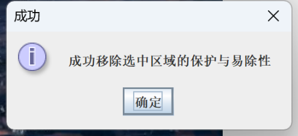

# Seam-Carving算法实现，UI设计与优化

## 成员

| 姓名   | 学号     |
| ------ | -------- |
| 杨璐祯 | 12212755 |
| 梁瑞健 | 12211812 |
| 赵蕾悦 | 12212756 |


## 介绍
SeamCarver 是一种图像处理算法，用于内容感知缩放（Content-Aware Image Resizing）。其主要目的是在保持图像关键内容的前提下，智能地调整图像尺寸。该算法通过在图像中找到“无缝路径”（seams），并移除这些路径来缩小图像，或插入这些路径来放大图像。SeamCarver 由 Shai Avidan 和 Ariel Shamir 于2007年提出。本次project在实现SeamCarver基本算法基础上增加了UI设计与优化，最终实现了扩图、缩图、保护选中区域、删除选中区域、撤销、还原等功能。
## 后端计算

### 动态规划算法

为了计算能量值之和最小的缝隙，我们可以使用动态规划的方法。在该问题中，如果在能量图一侧和另一侧放置分别放置一个虚拟的节点，那么我们可以将问题转化为一个最短路径问题。如果采用最小路径问题的Dijsktra算法，可以发现该算法与动态规划的思想是一致的，两种算法都依赖于最优子结构的性质，即一个问题的最优解包含了其子问题的最优解。现在，我们将使用动态规划算法来寻找能量值之和最小的缝隙。

对于一个能量图`energyMap`，我们可以定义一个二维数组`Vcost`，其中`Vcost[y][x]`表示从顶端到`(x, y)`的最小能量值之和。我们可以通过以下递推公式计算`Vcost`：

```java
traceMatrix[y][x] =
    Utils.minIndex(Vcost[y - 1][x - 1], Vcost[y - 1][x], Vcost[y - 1][x + 1]);
Vcost[y][x] = maskedEnergyMap[y][x] + Vcost[y - 1][x + traceMatrix[y][x]];
```

其中`maskedEnergyMap`在这里等同于`energyMap`，`traceMatrix`二维数组用于记录每个节点的最优路径。`Utils.minIndex`用于计算三个数中的最小值的相对位置(返回值为-1,0,1)。在计算`Vcost`的过程中，借助`traceMatrix`更新`Vcost`的同时，还可以记录路径。

下面是动态规划算法的思路(来自[WikiPedia](https://en.wikipedia.org/wiki/Seam_carving))：

<p align="center">
    
</p>


通过寻找`Vcost`的最后一行的最小值，并借助`traceMatrix`回溯，我们可以得到最小能量值之和的路径，并存储在`seam`数组中，其中`seam[y]`表示第`y`行的最小能量值之和的x坐标。

```java
seam[height - 1] = index;// index is the x-coordinate of the minimum energy value in the last row
for (int y = height - 2; y >= 0; y--) seam[y] = seam[y + 1] + traceMatrix[y + 1][seam[y + 1]];
```

### 增删像素

在缩图中，找到能量值之和最小的缝隙后，通过删除该缝隙对应的像素点实现缩图。此后，更新能量图。

```java
// remove the pixels
if (x < seam[y]) newPicture.setRGB(x, y, picture.getRGB(x, y));
else if (x > seam[y]) newPicture.setRGB(x - 1, y, picture.getRGB(x, y));
else pixels[y] = picture.getRGB(x, y);
```

```java
// update the energy map
if (x < seam[y] - 1) newEnergyMap[y][x] = energyMap[y][x];
else if (x > seam[y]) newEnergyMap[y][x] = energyMap[y][x + 1];
else newEnergyMap[y][x] = energy(x, y);
```

在扩图中，由于插入像素点后，新的能量图中能量最小的`seam`很可能停留在原来的`seam`上，因此我们尝试以一种新的方式更新能量图，即在原有的能量图中`seam`的位置，以及左右两侧加上`1000`的能量，以代替使用`energy`函数计算图像的能量。

```java
if (x < seam[y] - 1) newEnergyMap[y][x] = energyMap[y][x];
else if (x > seam[y] + 1) newEnergyMap[y][x] = energyMap[y][x - 1];
else newEnergyMap[y][x] = splitFlag ? energyMap[y][seam[y]] + 1000 : energy(x, y);
```

其中`splitFlag`用于标记是否在执行扩图操作，`splitFlag`为`true`时，表示执行扩图操作，否则执行缩图的`Redo`操作(在后文中会介绍)。

### 撤销和重做

我们另外添加了撤销`Undo`和重做`Redo`的功能。我们设定了操作数`op`，`XADD`表示横向扩图，`XSUB`表示横向缩图，`YADD`表示纵向扩图，`YSUB`表示纵向缩图。在每次扩图和缩图时我们使用三个栈分别存储`seam`，操作数`op`，以及被删除的像素点`pixels`以便于撤销和重做操作。

```java
// true for undo, false for redo
@Override
public void undo(boolean undo) {
    Stack<Integer> opStackFrom = undo ? undoStack : redoStack;
    Stack<Integer> opStackTo = undo ? redoStack : undoStack;
    if (opStackFrom.isEmpty()) return;
    Stack<int[]> seamsStacksFrom = undo ? undoSeamsStack : redoSeamsStack;
    Stack<int[]> pixelsStackFrom = undo ? undoPixelsStack : redoPixelsStack;
    Stack<int[]> seamsStacksTo = undo ? redoSeamsStack : undoSeamsStack;
    Stack<int[]> pixelsStackTo = undo ? redoPixelsStack : undoPixelsStack;
    int op = opStackFrom.pop();
    int invOp = ~op & 0b11;// invert the operation
    boolean add = (op == XADD || op == YADD);
    boolean direct = (op == XADD || op == XSUB);
    splitFlag = false;
    int[] seam = seamsStacksFrom.pop();
    if (undo ^ add) {
        // undo compress or redo strech: undo+XSUP or redo+XADD, insert the pixels
        int[] pixels = pixelsStackFrom.pop();
        insertPixels(direct ? XADD : YADD, seam, pixels);
        seamsStacksTo.push(seam);
    } else {
        // undo strech or redo compress: undo+XADD or redo+XSUB, remove the pixels
        int[] pixels = removePixels(direct ? XSUB : YSUB, seam);
        seamsStacksTo.push(seam);
        pixelsStackTo.push(pixels);
    }
    opStackTo.push(op);
}
```

在撤销操作中，我们将`seam`和`pixels`从撤销栈中取出，然后根据操作数`op`执行**相反**的操作。例如，如果`op`为`XADD`，则执行`XSUB`操作，即缩图操作。在重做操作中，我们将`seam`和`pixels`从重做栈中取出，然后根据操作数`op`执行**相同**的操作。例如，如果`op`为`XADD`，则执行`XADD`操作，即扩图操作。

### 选中保护与删除

我们希望选中一些区域，使得这些区域不会被删除，或者在删除时，这些区域会被优先删除。我们可以通过在能量图中增加能量很大或能量很小的值，改变`Vcost`，进而改变最小能量值之和的路径，当能量值很大时，`seam`会尽可能绕过这些区域，当能量值很小时，`seam`会尽可能经过这些区域。

我们用一个二维数组`mask`来表示选中区域，且当前端设置了`mask`，即执行`setMask`函数时，`maskFlag`设置为`true`，此后，在每次计算`Vcost`时，我们将`mask`中的值加到`energyMap`中，得到`maskedEnergyMap`，然后计算`Vcost`。

```java
if (maskFlag) maskMap();
else maskedEnergyMap = energyMap;
```

在增删像素后，我们需要根据`seam`更新`mask`

```java
// XADD
if (x < seam[y]) newMask[y][x] = mask[y][x];
else if (x > seam[y]) newMask[y][x] = mask[y][x - 1];
else newMask[y][x] = 0;

// XSUB
if (x < seam[y]) newMask[y][x] = mask[y][x];
else if (x >= seam[y]) newMask[y][x] = mask[y][x + 1];
```

要取消选中区域的保护与删除，执行`removeMask()`函数将`maskFlag`设置为`false`即可

## 前端设计
### GUI设计
运行Test.java后，首先会出现弹窗如下，帮助用户从本地路径打开图片。
<p align="center">
    
</p>
用户从路径中选择图片打开后，会出现主窗口如下。
<p align="center">
    
</p>
主窗口的左上角的工具栏有两项，分别为“文件”和“帮助”。
<p align="center">
  
  
</p>
用户可以在文件一栏中选择从本地路径打开新的图片，保存当前版本的图片和关闭窗口。用户在帮助一栏的“关于”中可以查看本项目的作者、版本信息和同步至github的网址，在“贴士和技巧”中查看对页面各按钮及功能的使用说明。
<p align="center">
    
    
</p>
主窗口主体部分的左侧为显示图片的子窗口，右侧为工具栏。主窗口的左下角可以实时查看用户的鼠标当前或最后一次在左侧子窗口上停留的点的坐标值。右侧的工具栏分为三个模块，分别为设置图片大小、选中保护与删除和操作。
在“设置图片大小”模块中，“宽度”栏和“高度”栏默认显示为原始图片的尺寸。用户可以在这两栏里输入想得到的图片尺寸数值，输入新的数字并回车后，程序便会计算并显示出处理后为该尺寸的图片。用户还可以直接点击或长按这两个输入栏右侧的上下箭头，一次箭头出发对应删除或增加一条缝，长按为连续变化。用户可以通过单次点击或长按“撤销”按钮来撤销对图片的上一步操作，通过单次点击或长按“重做”按钮来还原上一步撤销。

“选中保护与删除”模块是套索功能的相关按钮。用户想在图片上画出套索区域，首先需要点击“套索工具”，会弹出介绍了使用方法的弹窗如下。
<p align="center">
    
</p>
按鼠标左键绘制出的套索对应想要保护区域，显示为红色。按鼠标右键绘制出的套索对应想要删除的区域，显示为绿色。用户关闭弹窗后，“套索工具”按钮右侧的对勾会被程序自动勾选。这个对勾不被勾选时，用户无法绘制套索。用户点击“确定”按钮后，会弹出弹窗如下，此时已绘制出的区域会生效，并将作用于用户接下来在上一个模块中做的缩图和扩图操作。
<p align="center">
    
</p>

而如果用户在没有先点击“套索工具”的前提下点击“确定”，会弹出提示弹窗如下，且不进行其他记录。
<p align="center">
    
</p>
用户点击“取消区域”后，会弹出弹窗如下，之前生效的区域会变为无效，不会影响接下来对图片的处理。
<p align="center">
    
</p>
在“操作”模块中，用户点击“保存”按钮可以保存当前版本的图像到本地，点击“还原”按钮可以一键让显示的图片变为刚打开时原始的版本。
<p align="center">
    
</p>

### 功能展示

#### 按钮设计
首先为了用户良好体验，套索按键在监听用户点击后跳出对应说明窗口内容`“请在图像上用鼠标拖动进行选区，画出保护区域请用鼠标左键（显示为红色），画出消除区域请用鼠标右键（显示为绿色）”`，并开始使用`selectionToolActive`以及`selectionCheckBox.setSelected`进行内容判定。
#### 具体实现
```java
private ArrayList<Point> highPriorityPoints = new ArrayList<>();
private ArrayList<Point> lowPriorityPoints = new ArrayList<>();
private boolean selectionToolActive = false;
private JCheckBox selectionCheckBox = new JCheckBox();
```
由于我们希望套索能用鼠标左右键区分画出不同颜色的套索线，然后分别实现保护和消除功能，所以先建立两个链表用来存放保护像素点（`highPriorityPoints`），以及消除像素点（`lowPriorityPoints`）。`selectionToolActive`以及`selectionCheckBox`分别为套索启动判定和勾选显示。为了保证套索是在图片对应label上实施，我们先创建一个`ImageIcon`对象来显示图像，并将其设置为`JLabel`对象的图标。然后再创建一个`JLabel`对象，并写出其`paintComponent`方法以在图像上绘制多边形。绘制多边形我们选择构建`drawPolygon`函数，通过外界鼠标点击/拖动构成的像素点坐标链表，以及`Graphics2D`绘图画出有效多边形。
```java
private void drawPolygon(Graphics2D g2d, ArrayList<Point> points, Color color) {
            int[] xPoints = new int[points.size()];
            int[] yPoints = new int[points.size()];

            for (int i = 0; i < points.size(); i++) {
              Point point = points.get(i);
              xPoints[i] = point.x;
              yPoints[i] = point.y;
            }

            g2d.setColor(color);
            g2d.drawPolygon(xPoints, yPoints, points.size());
          }
```
同时为保证套索在页面放大时也能够正确采样，我们将图片左上角与页面左上角固定，保证套索采样坐标始终正确，不会根据窗口页面放大/缩小/全屏化而产生偏移而选取范围不正确。套索函数中我们将分出三种鼠标状态来构成完整过程：
在按压鼠标（开始采样）时采用`SwingUtilities.isLeftMouseButton(e)`以及`SwingUtilities.isRightMouseButton(e)`进行左右键判定，若为左键则先清空`highPriorityPoints`再进行当前点击采样；若为右键则换成`lowPriorityPoints`进行操作。若此点击结束则进行`label.repaint()`重绘来获取新的采样点。
在拖动鼠标（采样过程中）时进行上述左右键判定和点击点采样以及重绘获取新的点过程。
在释放鼠标资源（结束采样）时同样进行上述左右键判定和点击点采样以及重绘获取新的点过程，此时由于是释放鼠标步骤，则可认为用户采集完毕，采用`seamCarver.setMask(calculateMask())`;更新`mask`矩阵。

##### 套索采集点后进行mask矩阵计算
```java
 private void applyPriorityToMask(ArrayList<Point> points, float[][] mask, float value) {
    if (points.size() < 3) return;
    Polygon polygon = new Polygon();
    for (Point point : points) polygon.addPoint(point.x, point.y);

    for (int y = 0; y < mask.length; y++)
      for (int x = 0; x < mask[0].length; x++) if (polygon.contains(x, y)) mask[y][x] = value;
  }
```
创建`applyPriorityToMask`方法为后续`calculateMask()计`算做准备，在`applyPriorityToMask`里使用`Polygon`性质来判断链表内点坐标是否在多边形内部，若在则赋值。在`calculateMask`里则先初始化mask矩阵保证其大小与获取到的图片大小一致。然后运用以下两行代码使`mask`矩阵完整。`0`代表不做处理，`1e5`表示保护，`-1e4`表示优先删除
```java
applyPriorityToMask(highPriorityPoints, mask, 1e5f);
applyPriorityToMask(lowPriorityPoints, mask, -1e4f);
```

#### 套索功能展示
以下面三组图像为示例，展示目标尺寸相同的基本缩图与有两种套索的缩图。
<p align="center">
    
    
</p>

左图：打开示例图片；右图：修改右上角的数值，将图片尺寸改至250*150。

<p align="center">
    
    
</p>

左图：用红色保护套索框选天空；右图：确定套索，将图片尺寸改至250*150。

<p align="center">
    
    
</p>

左图：用绿色删除套索框选天空；右图：确定套索，将图片尺寸改至250*150。

对比上面三组图后我们发现，第一组中天空部分的高度明显缩小，但在第二组图中用红色保护套索框选天空后缩图时，天空的高度没有变化，说明成功完成了对其的保护。
在第三组图中，我们用绿色删除套索框选了原图的主体之一，右侧的人物。在缩图后，右侧的人物被删去了，说明成功完成了对其的删除。

## 优化
1. 每次扩图和缩图后，更新能量图时，我们可以只更新`seam`附近的能量值，而不是整个能量图以减少计算量。
2. 在撤销和重做操作中，我们可以只存储`seam`附近的像素点，而不是整个像素点数组以减少内存占用。
3. 使用了cpu多线程来加速计算
   ```java
   interface ParallelFunc {
       void process(int cpu, int cpus);
   }
   
   public static void parallel(ParallelFunc func) {
       int cpus = Runtime.getRuntime().availableProcessors();
   
       Thread[] threads = new Thread[cpus];
       for (int i = 0; i < cpus; i++) {
           int cpu = i;
           threads[cpu] = new Thread(() -> func.process(cpu, cpus));
       }
   
       for (Thread thread : threads) {
           thread.start();
       }
   
       try {
           for (Thread thread : threads) {
               thread.join();
           }
       } catch (InterruptedException ignored) {
       }
   }
   ```

## 参考文献
Michael Rubinstein, Ariel Shamir, and Shai Avidan. 2008. Improved seam carving for video retargeting. ACM Trans. Graph. 27, 3 (August 2008), 1–9. https://doi.org/10.1145/1360612.1360615